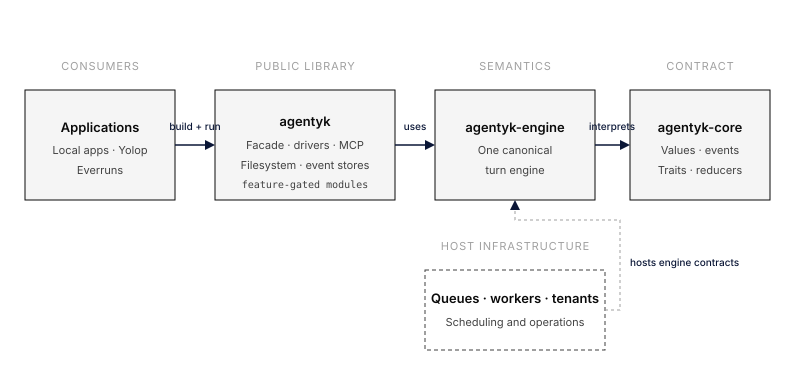
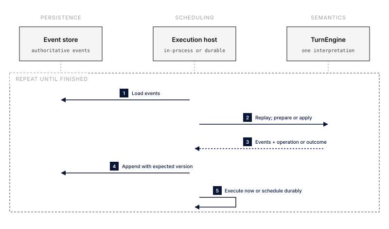

# Architecture

Agentyk is a value-first library for composing agents and running them in
different environments. Applications build one `Agent` from a model,
instructions, capabilities, tools, and policies. They do not create database
records or pass registry ids through the API.

The architecture separates three concerns:

1. the portable agent protocol and turn state;
2. the canonical engine that interprets that protocol;
3. the library facade and its bundled implementations.

This separation lets a local application, Yolop, and a durable Everruns host
run the same agent semantics without sharing infrastructure.

## Crates

### `agentyk-core`

`agentyk-core` is the portable contract. It contains:

- messages, model requests and responses, tool calls, and typed correlation
  ids;
- events and the event-store contract;
- `Tool`, `Capability`, and `ChatDriver` extension traits;
- the serializable turn state and its pure event reducer.

Core has no HTTP client, async runtime, process spawning, filesystem access, or
orchestration loop. It is the small dependency used by hosts and extensions
that implement an Agentyk contract.

### `agentyk-engine`

`agentyk-engine` is the single canonical implementation of agent-turn
semantics. It contains:

- `Agent`, `AgentBuilder`, and `Session`;
- agent assembly and context preparation;
- middleware, cancellation, budget, and failure policy;
- the step engine that prepares operations and applies their results;
- the in-process runner.

The word *engine* does not mean that every execution environment implements a
different engine. There is one engine and multiple **hosts**. A host decides
how an operation is scheduled and where events are stored; the engine decides
what the operation means.

### `agentyk`

`agentyk` is the public facade most applications depend on. It re-exports core
and engine, and includes the library's bundled modules:

- the scripted, OpenAI-compatible, and Anthropic drivers;
- the JSONL and in-memory event stores;
- MCP client and capability support;
- filesystem abstractions and the filesystem capability.

MCP and filesystem support are library capabilities, not external integration
crates. Provider drivers and other integrations also remain feature-gated
modules in `agentyk` for now. The architecture does not require satellite
crates.



## Agent definition and environment

An agent's definition is distinct from the environment that runs it.

```text
AgentDefinition                 AgentEnvironment          Session / TurnHost
├── name                        ├── drivers               ├── event store
├── instructions                ├── event observers       ├── session id
├── default model               └── runtime services      └── cancellation
├── capabilities
└── turn policy
```

This is an internal lifecycle boundary, not extra ceremony in the public API.
`AgentBuilder` can configure both and still produce one runnable `Agent`.

The distinction keeps behavioral configuration separate from executable
resources, while session storage remains a per-run concern. Everruns may
reconstruct the environment and session host for each durable activity, while
a local application can keep them in memory.

`ModelSpec` currently carries optional credentials and endpoint overrides.
That makes a definition containing them sensitive configuration, not a value
to put in an event log. Prepared engine operations are runtime values and are
also not serializable. Durable hosts persist the emitted domain events and
resolve credentials from protected host configuration when an activity runs.

## One engine, multiple hosts

The engine advances a turn one operation at a time:



Operations include a model request, a batch of tool calls, and a completed
turn. Middleware and policy are applied by the engine before an operation is
handed to a host. Operation results return to the engine, which produces the
same domain events regardless of the host.

### In-process execution

The in-process host loops over engine steps in one async call. It invokes the
configured model and tools directly and immediately applies their results.
A tool dispatcher may execute a batch sequentially or concurrently without
changing the rest of the turn loop.

### Durable execution

Everruns uses the same step engine but gives every step a durable boundary:

1. load the session's events and reduce them into turn state;
2. ask the engine for the next operation;
3. atomically append the engine's durable events;
4. schedule the operation as a retryable activity;
5. give the activity result back to the engine;
6. append the resulting events and schedule the next operation.

The durable host owns queues, leases, retries, transactions, tenants, and
workers. None of those concepts enter core. The engine continues to own
middleware order, state transitions, event meanings, and turn outcomes.

This design does not require a second `DurableEngine` or a custom copy of the
turn loop.

## Events and replay

Durable events are the source of truth. Both conversation history and turn
state must be reconstructable from them. A checkpoint may cache a reduced
state, but it is disposable and must produce the same result as replay:

```text
snapshot + later events == all events reduced from the beginning
```

The event store appends a batch with an expected stream version. This gives a
server host an atomic write boundary and prevents two workers from advancing
the same session concurrently. It also exposes an indexed head and bounded
event pages, so a write or historical read does not require loading the whole
stream.

`SessionPoint` addresses an immutable event prefix. A session can inspect such
a point without executing, or fork a completed-turn point into an independent
session whose `session.forked` event records the lineage. The original branch
is never rewritten. Separately, `Session::resume_pending` can continue the
newest incomplete turn at the current head with at-least-once external-action
semantics. `SnapshotStore` is a separate optional contract for named,
schema-versioned projection caches; snapshots accelerate replay but never
replace events as the authority.

Context assembly receives the exact session point, turn and iteration,
effective model, optional token ceiling, and event-store access. Its result can
carry provider messages, token accounting, provenance, and observational
events. This supports trimming, summaries, and memory without confusing
model-context compaction with durable-history retention.

Streaming deltas and similar transient notifications use an event observer,
not the durable event store. Unknown observational events may be ignored;
unknown events needed to reduce turn state must stop replay rather than be
silently treated as metadata.

## Capabilities and integrations

A capability contributes agent behavior by value. Its resolved contribution
may contain instructions, tools, and the middleware governing those tools.
This lets a filesystem or MCP capability package its behavior without a
registry or a host-specific id.

User hooks are a parallel operator-facing seam at six stable lifecycle
points. Their payload and decision types live in core; the canonical engine
owns ordering and mutation/block semantics. Process execution does not:
feature `hooks` supplies a trusted local shell adapter, while a sandboxed or
durable host implements the same `Hook` trait using its own executor.

Heavy dependencies remain optional through Cargo features:

```text
http  → OpenAI-compatible and Anthropic driver modules
mcp   → MCP client and capability module
fs    → filesystem abstractions and capability module
hooks → trusted local shell-hook executor
full  → all bundled modules
```

Feature-gated modules are the current packaging unit. A separate crate should
only be considered when an actual dependency or release problem requires it.

## Dependency direction

Dependencies point inward:

```text
bundled modules ──► engine ──► core
host infrastructure ─────────► core and engine contracts
```

Core never imports engine or a bundled module. Engine never imports an HTTP
provider, MCP transport, filesystem implementation, or host infrastructure.
This is what lets Everruns and Yolop share agent semantics while retaining
their own operational models.
